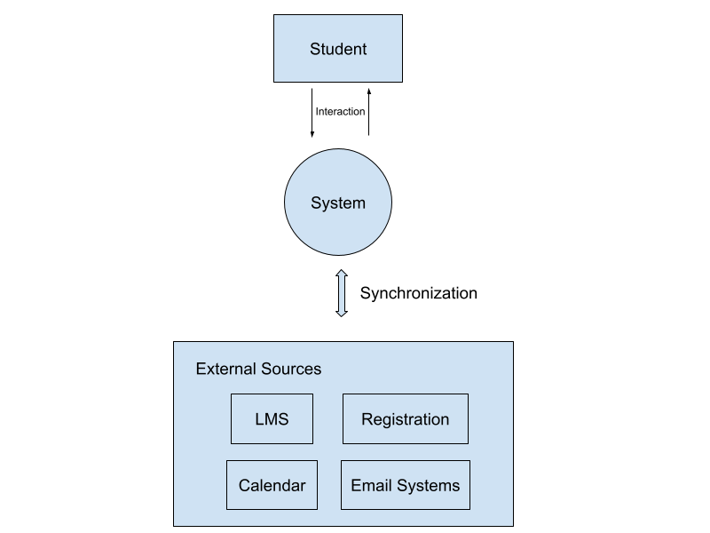
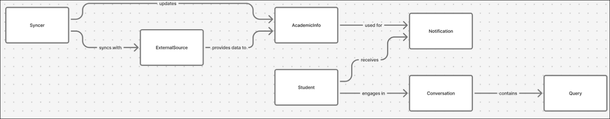
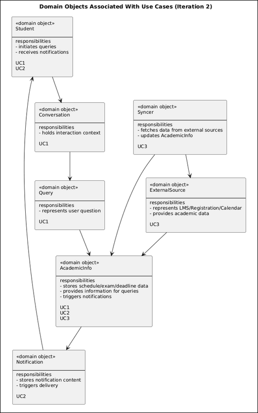
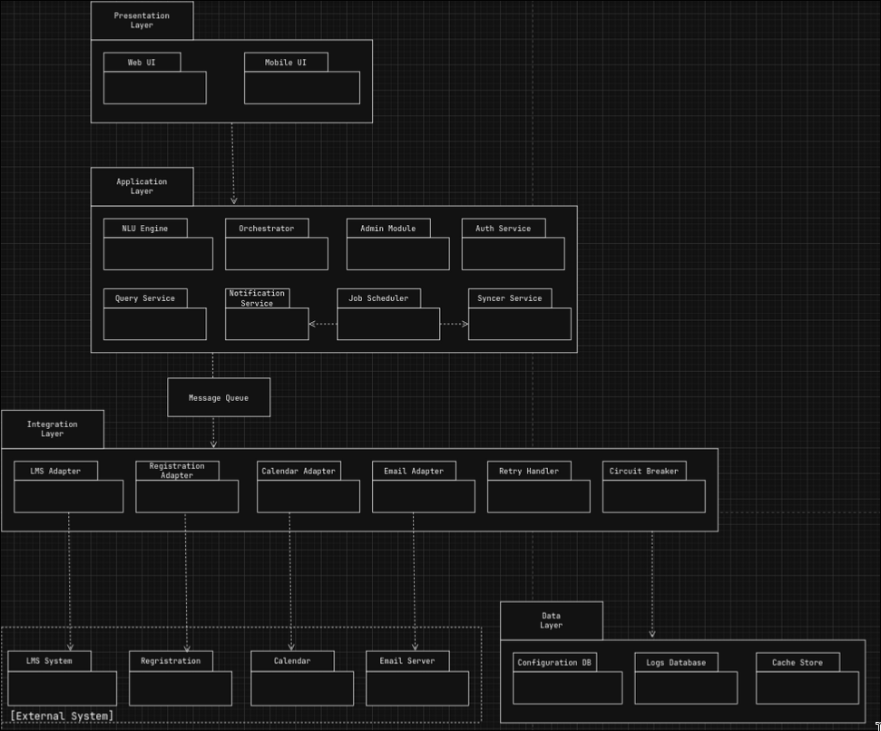
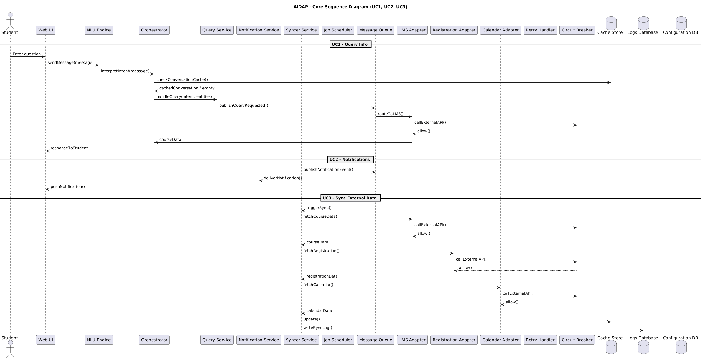

# Iteration 2

## Step 1: Review Inputs

The following architectural drivers guide this iteration:

### **Use Cases**  
*(See: [Use Cases.md](Use%20Cases.md))*
- UC1 – Query Info  
- UC2 – Get Notifications  
- UC3 – Sync External Data  
- UC4 – Manage Course Content  
- UC5 – View Analytics  
- UC6 – Configure System  
- UC7 – Monitor System  

### **Concerns**  
*(See: [Concerns.md](Concerns.md))*
- CRN-1 – Data privacy & security  
- CRN-2 – Performance & availability  
- CRN-3 – Reliable system integration  
- CRN-4 – Accurate AI interpretation  

### **Constraints**  
*(See: [Constraints.md](Constraints.md))*
- CON-1 – Avg response ≤ 2 seconds  
- CON-2 – Cloud-native continuous deployment  
- CON-3 – Must use AI/NLU models  
- CON-4 – Scale to 5,000 concurrent users  
- CON-5 – 99.5% uptime with failover  

### **Quality Attributes**  
*(See: [Quality Attributes.md](Quality%20Attributes.md))*
- QA1 – Privacy & Security  
- QA2 – Scalability  
- QA3 – Interoperability  
- QA4 – Availability  
- QA5 – Usability  
- QA6 – Maintainability  

---

## Step 2: Establish Iteration Goal by Selecting Drivers

The goal of this iteration is to identify and address the general architectural structure into a more specific architecture to support AIDAPs primary requirements. This iteration process includes defining the main elements like the objects and modules which will implement the main uses as well as allocating their responsibilities across each layer. Additionally it will focus on providing the main structure to ensure consistency and performance across all times.

### **Selected Drivers:**

#### **Use Cases:**
- **UC1:** Query Info – processing natural-language questions.
- **UC2:** Get Notifications – delivering upcoming deadlines.
- **UC3:** Sync External Data – integrating with LMS, registration, and calendar systems.

#### **Concerns:**
- **CRN-2:** Maintain consistent availability and performance during peak usage.
- **CRN-3:** Ensure reliable synchronization with external university systems.

#### **Quality Attributes:**
- **QA2:** Scalability – system must handle increased user load.
- **QA3:** Interoperability – system must integrate smoothly with external systems.
- **QA4:** Availability – system must remain operational with minimal downtime.

---

## Step 3: Choose One or More Elements of the System to Refine

### **High-Level Step 3 Diagram**

The main parts of the architecture we are refining is the interaction between students and the system, as well as how all of the external elements within the system are connected to optimize scalability and availability. This is mainly to ensure the system functionality achieves its main purpose and is operating as intended, as well as making sure the architecture supports the system for peak loads, maintaining consistency and performance.

---

## Step 4: Choose One or More Design Concepts That Satisfy the Selected Drivers

A domain model will be implemented first as decomposition is not possible without the domain model. After domain objects will be chosen to map to those said functional requirements.

### **Components:**

#### **Previous concepts from the previous iteration will be used:**
- **Layered Architecture** – Separates the system into clear layers.
- **Adapter Pattern** – Helps connect to different external systems.
- **Cloud-Native Deployment** – Supports scaling and reliability.

#### **New concepts to be added include:**
- **Message Queue / Event Bus** – Manages tasks and prevents overload.
- **Caching** – Fast temporary storage for quicker access.
- **Circuit Breaker & Retry Pattern** – Prevents repeated calls to failing services and retries safely.
- **Background Job Scheduler** – Runs tasks like synchronization at regular intervals.

---

## Step 5: Instantiate Architectural Elements, Allocate Responsibilities, and Define Interfaces

A basic domain model is created to represent the main objects, their responsibilities, and how they relate. It helps break the system into parts to create a main foundation for later decomposing the architecture into modules.

---

### **Old Components**

#### **Layered Architecture:**
- Presentation Layer – user interfaces, chat channels  
- Application Layer – NLU, intent handling, orchestration  
- Integration Layer – connectors to LMS, registration, calendar APIs  
- Data Layer – databases, logs, configuration storage  

**(Linked Drivers: UC1, UC2, UC3, CRN-2, QA2, QA4)**

---

#### **Adapter Pattern:**
Used in the Integration Layer to unify access to different university systems. Each external API (LMS, registration, calendar) gets its own adapter, which exposes a consistent interface to the rest of the system. This keeps the Application Layer isolated from API differences and supports reliable synchronization.

**(Linked Drivers: UC3, CRN-3, QA3)**

---

#### **Cloud-Native Deployment:**
The system is deployed as scalable cloud services. This allows components like sync jobs, notification handlers, and the main application to scale independently. It also supports high availability and ensures the system can handle peak loads.

**(Linked Drivers: CRN-2, QA2, QA4, supports UC1/UC2/UC3 indirectly)**

---

### **New Components**

#### **Message Queue/Event Bus:**
Ensures consistent and reliable performance even during peak times of load. Ensuring the system isn’t overloaded with multiple processes at once. This additionally applies for when the system needs to send information from the system to the individual student. That way a more streamlined pipeline is used for sending data and ensuring consistent performance.

**Location and Component:**  
Message Queue:  
Between Application and Integration Layer  

**(Linked Drivers: CRN-2, UC2, QA2, QA4)**

---

#### **Caching:**
This will be individual conversations for each student for temporary information. This is to ensure performance during times of consistent load, rather than sending all information to the database to send it would instead be loaded into a cache which will allow the system to quickly access it for quick and snappy responses while reducing load on the database.

**Location and Component:**  
Cache Store:  
Data Layer (further refined)

**(Linked Drivers: CRN-2, UC1, QA2)**

---

#### **Circuit Breaker and Retry Pattern:**
These patterns handle stopping a system from endlessly attempting to access a failing API, as well as retrying to start up the server after an unexpected shut down. These patterns mainly are put into place to ensure the system is constantly available and reliable at all times while not wasting resources on attempting to access failing APIs.

**Location and Component:**  
Circuit Breaker & Retry Handler:  
Integration Layer (attached to all external system adapters)

**(Linked Drivers: CRN-3, UC3, QA3, QA4)**

---

#### **Background Job Scheduler:**
This component of the system handles tasks such as syncing external data or sending out notifications. This is mainly to ensure performance in the backend server since having a scheduler to regularly send out intervals of data is a much more efficient use of resources rather than having data sent out randomly or as fast as possible. This reduces load on the server as well as ensuring consistent and reliable operations.

**Location and Component:**  
Job Scheduler:  
Application Layer (triggers Syncer Service and Notification Service)

**(Linked Drivers: UC2, UC3, CRN-2, QA2, QA4)**

---

## Step 6: Draw the actual accurate part of the architecture in the step process

### **Domain Model Diagram**

### **Mapped Domain Model Diagram**

### **Layered Architecture Diagram**

### **Sequence Diagram**

---

## Step 7: Verifying that the architecture satisfies the selected use cases and concerns for this iteration

**UC1 (Query Info)** is supported through the NLU Engine, Orchestrator, and Query Service. The NLU interprets the student’s question, the Orchestrator determines what information is required, and the Query Service retrieves academic data through the Integration Layer adapters. Caching helps speed up repeated queries, supporting consistent performance.

**UC2 (Get Notifications)** is supported through the Notification Service and the Message Queue. The Notification Service creates notification messages, the Message Queue handles delivery without overloading the system, and the Email Adapter sends them to the student. The Job Scheduler can trigger scheduled notifications when needed.

**UC3 (Sync External Data)** is supported through the Syncer Service, which communicates with LMS, Registration, and Calendar Adapters to retrieve updated academic information. The Retry Handler and Circuit Breaker ensure stable synchronization even if external systems fail.

**Concern CRN-2 (performance and availability)** is addressed through caching, the Message Queue, and the separation of responsibilities in the Application Layer, which allow the system to maintain performance during peak loads.

**Concern CRN-3 (reliable integration)** is addressed through the Adapter Pattern together with the Retry Handler and Circuit Breaker, ensuring consistent and dependable communication with external university systems.

**QA2 (Scalability)** is supported by cloud-native deployment, caching, and message queue.

**QA3 (Interoperability)** is supported by adapters and stable retry logic.

**QA4 (Availability)** is supported by circuit breaking, retry, and distributed scaling.

Based on these checks, the architecture satisfies all selected use cases and concerns for this iteration.

