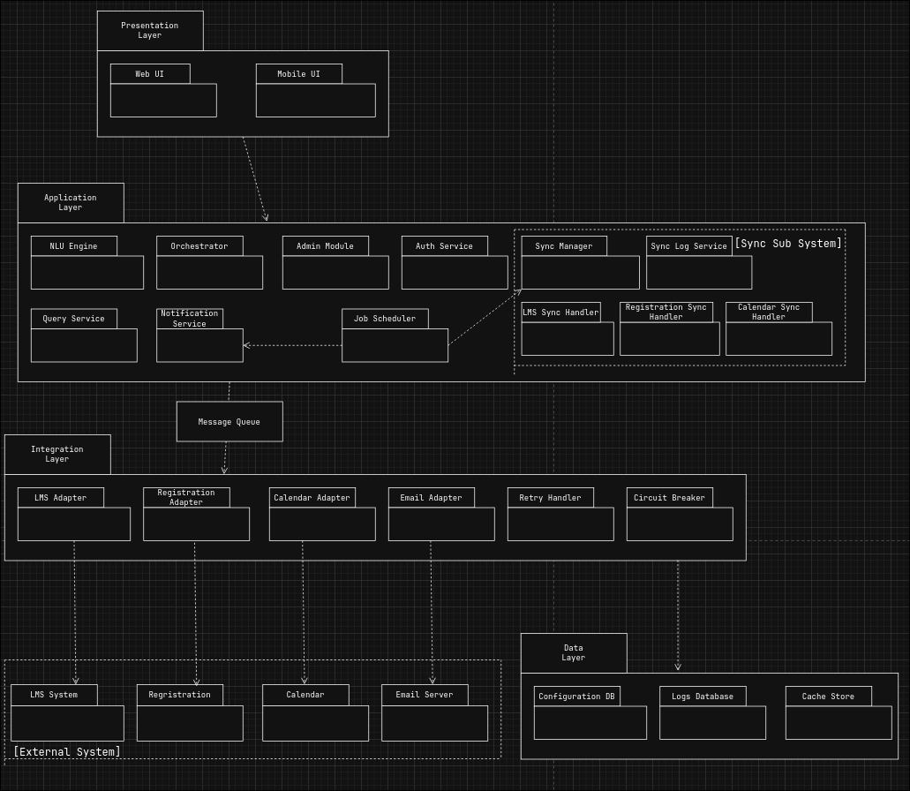
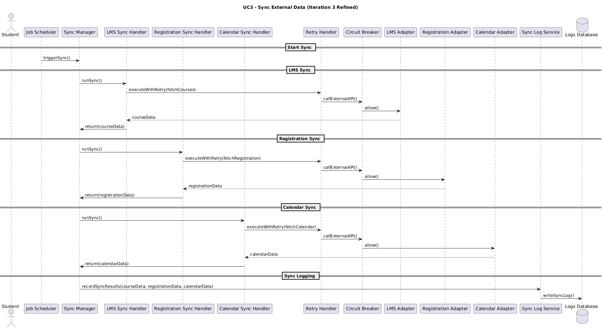

# Iteration 3 - 7steps 

## Step 1: 

## Step 2: Establish Iteration Goal by Selecting Drivers

Refine the internal architecture of the Sync Subsystem to ensure:

    reliable periodic synchronization
    safe external API access
    retry + circuit-breaker behavior
    consistency with cloud-native deployment

## Step 3: Choose One or More Elements of the System to Refine

Element to refine: 

    Sync Subsystem (consist of Job Scheduler , Syncer Service , Adapters , Retry Handler , Circuit Breaker)

    The part of the architecture we are refining now is the synchronization workflow, since it still has many parts that were not fully defined in the previous iteration. This includes how scheduled jobs trigger sync operations, how failures are handled, and how the system interacts with external APIs without breaking during peak load or outages. Refining this system make sures the system stays reliable, consistent, and stable even when external services behave unpredictably.

## Step 4: Choose One or More Design Concepts That Satisfy the Selected Drivers

For this iteration, we focus on the sync and reliability subsystem, so the design concepts are chosen to make synchronization reliable, fault-tolerant, and safe when external systems misbehave.

    Scheduled Task Runner: Triggers sync at fixed intervals to avoid random load spikes.
    Structured Sync Pipeline: Clear stages for fetching, transforming, and storing data.
    Retry Pattern: Safely retries temporary failures when external systems are unstable.
    Circuit Breaker: Stops repeated calls to failing APIs to protect the system.
    Bulkhead Pattern: Keeps each external system’s sync isolated so one failure doesn’t block others.
    Sync Logging: Records sync results for monitoring and debugging.

    These concepts directly strengthen UC3 and address concerns around reliability, availability, and stable external integration.

## Step 5: Instantiate Architectural Elements, Allocate Responsibilities, and Define Interfaces

    JobScheduler:
    Runs sync tasks at fixed intervals to keep updates consistent.

    SyncManager:
    Coordinates each sync run and routes jobs to the correct handler.

    SyncHandlers (LMS / Registration / Calendar):
    Perform the core sync steps: fetch --> transform --> validate --> store.

    RetryHandle:
    Retries temporary failures safely to improve reliability.

    CircuitBreaker:
    Stops calls to failing external systems until they recover.

    External Adapters:
    Provide a consistent interface to each external API.

    Sync Log Service:
    Tracks sync results for monitoring and troubleshooting.

These components together create a stable, fault-tolerant sync workflow.

## Step 6: Sketch Diagrams
### Architecture Diagram

### Sequence Diagram

## Step 7: Verifying That the Architecture Satisfies the Selected Drivers

This iteration focuses only on refining the Sync Subsystem for UC3 - Sync External Data.  
The goal was to improve reliability and stability when interacting and syncing with external systems.  
The refinements introduced in Steps 4 and 5 address these goals directly.

The updated sync workflow now satisfies UC3 more effectively through these several components:

**SyncManager**  
Provides a single coordination point for all sync operations. It ensures that scheduled syncs follow a consistent and predictable workflow.

**Dedicated SyncHandlers (LMS, Registration, Calendar)**  
Each external system has its own handler. This separation implements the bulkhead pattern and prevents failures in one system from affecting the others.

**Structured Sync Pipeline**  
Each handler follows the same sequence of steps (fetch - transform - validate - store).  
This reduces errors, improves maintainability, and ensures consistent data processing.

**Sync Log Service**  
Records sync attempts, results, and failures. This improves observability and supports debugging and monitoring over time.

These new components added to the refined sync system make UC3 more reliable, predictable, and tolerant of external instability than the version defined in the previous iteration.

**CRN-3 - Reliable System Integration**  
Addressed through retry handler, circuit breaker, dedicated handlers, and adapters.  
The architecture now handles unstable or unexpected results without causing system-wide failures.

**QA4 - Availability**  
Strengthened by circuit breaking, controlled retries, bulkhead isolation, and scheduled sync behavior.  
The system remains available even when services go down.

**QA3 - Interoperability**  
Improved through clear separation between internal sync logic and external adapters.  
Each external system is integrated through a stable, consistent interface.

**QA2 - Scalability**  
Supported by handlers isolated from each other, cloud-native deployment, and periodic scheduling that avoids sudden load spikes.

The refinements introduced in this iteration through the SyncManager, separate SyncHandlers, structured pipelines, and Sync Log Service directly satisfy the goals of UC3 and the related concerns (CRN-3) and quality attributes (QA3, QA4, QA2).  
The Sync Subsystem is now more reliable, robust, and scalable, meeting the objectives of Iteration 3.

