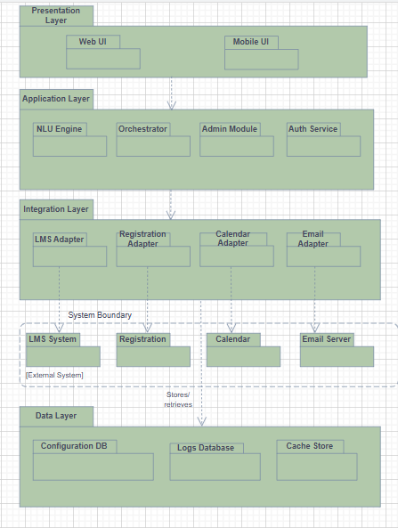

# Iteration 1 – Seven Steps

## Step 1: Review Inputs

The inputs in phase 1 define the primary drivers for iteration 1. The goal is to achieve:  
- Strong interoperability with university systems.  
- High performance and availability.  
- Scalable and maintainable architecture.  
- Secure handling of user data.  
- Seamless user experience through natural-language interaction.  

## Step 2: Establish Iteration Goal by Selecting Drivers

### Iteration Goal:
The goal of this iteration is to define a layered, modular architecture that supports natural-language processing, reliable system integration, and scalable cloud deployment and at the same time meeting performance, availability, and security requirements.

### Selected Drivers:

#### Functional Drivers:
- UC1 – Query Info: Users request academic information using natural language.  
- UC3 – Sync External Data: The system communicates with LMS, registration, and calendar APIs.  
- UC6 – Configure System: Administrators update workflows, policies, and configurations.

#### Quality Attributes:
- QA2 – Scalability: Architecture must support growth in user load.  
- QA3 – Interoperability: Must integrate smoothly with multiple university systems.  
- QA4 – Availability: System should remain operational with minimal downtime.

#### Concerns:
- CRN-1: Ensuring secure access control, SSO authentication, and compliance.  
- CRN-3: Managing reliable communication and synchronization with external systems.

#### Constraints:
- CON-2: Must support cloud-native, zero-downtime deployment.  
- CON-4: Must efficiently handle up to 5,000 concurrent users.  

## Step 3: Choose One or More Elements of the System to Decompose

Since AIDAP is being designed from scratch, the element selected for refinement in this iteration is the AIDAP system as a whole. At this stage, the system is treated as a single black-box component that interacts with external actors and institutional systems.

- **Element to decompose: AIDAP System**

## Step 4: Choose Design Concepts That Satisfy the Selected Drivers

The primary architectural style selected for AIDAP is a Layered Architecture.  
Additional design concepts such as the Adapter pattern, centralized authentication, and cloud-native deployment are used to support key drivers.  

### Layered Architecture:
- Presentation Layer – user interfaces, chat channels  
- Application Layer – NLU, intent handling, orchestration  
- Integration Layer – connectors to LMS, registration, calendar APIs  
- Data Layer – databases, logs, configuration storage  

We have used an adapter pattern here in combination with layered architecture to integrate AIDAP system with different universities through unified interface in order to align with interoperability requirement and to isolate external API differences.  

### Adapter / Facade Pattern for External Systems:
- Supports UC3 – Sync External Data  
- Ensures reliable integration (CRN-3)  
- Enforces interoperability (QA3) despite different external APIs  

AIDAP will use a single entry point for authentication (via SSO) and authorization.

### Centralized Authentication and Security Concept:
- Addresses security, privacy, compliance  
- Protects sensitive student and instructor data  
- Ensures consistent access control across all modules  

AIDAP is designed to run as a distributed, cloud-deployable system.

### Cloud-Native Deployment:
- Supports CON-2 (zero-downtime deployment)  
- Enables elastic scaling to meet CON-4  
- Improves resilience and uptime  

## Step 5: Instantiate Architectural Elements, Allocate Responsibilities and Define Interfaces

### Presentation Layer:
- **Conversation Interface:**  
  Handles user input/output through web or mobile chat interfaces.

### Application Layer:
- **NLU Engine**  
  Interprets natural-language queries and extracts intent and key entities.  
- **Conversation Orchestrator**  
  Coordinates request handling by routing interpreted intents to the appropriate services or adapters.  
- **Admin Console**  
  Allows administrators to configure workflows, policies, and system settings.

### Integration Layer:
- **LMS Adapter**  
  Provides standardized methods to fetch course content, assignments, and grades.  
- **Registration Adapter**  
  Handles schedule, enrollment, and academic record queries.  
- **Calendar Adapter**  
  Provides access to university calendars and schedule data.  
- **Common Integration API**  
  A unified interface used internally by the orchestrator to request data from any external system.

### Data Layer:
- **Configuration Store**  
  Holds system policies, admin settings, and integration keys.  
- **Log & Metrics Service**  
  Records system behavior, errors, and performance data for maintainers.  
- **Authentication Provider (SSO)**  
  Provides secure, centralized access control.

### High-Level Responsibilities of Each Layer:
- Presentation Layer: Collects user messages and displays system responses.  
- Application Layer: Interprets queries, applies logic, and determines which information is required.  
- Integration Layer: Communicates with external university systems (LMS, registration, calendar) through standardized adapters.  
- Data Layer: Stores configuration data, logs, and other system information required for reliable operation.  

## Step 6: Sketch Views and Record Design Decisions

### Architecture Diagram
